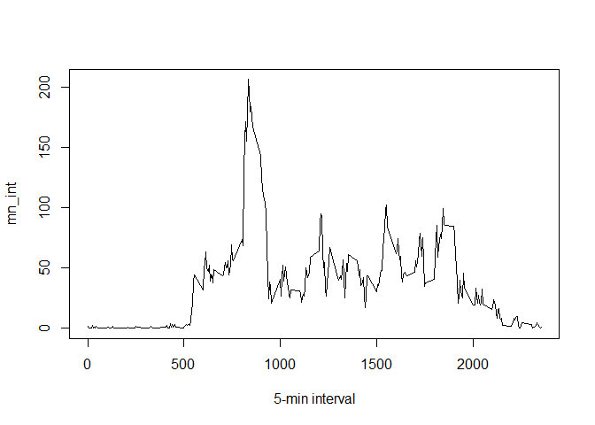
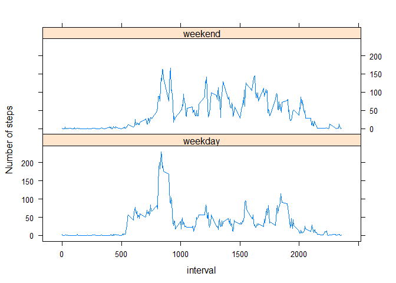

# Reproducible Research: Peer Assessment 1


## Loading and preprocessing the data

```r
echo = TRUE
# unzip the activity.zip file and then read the activity.csv file 
unzip("activity.zip")
activity <- read.csv("activity.csv", header = T, sep = ",")
```
## What is mean total number of steps taken per day?

```r
echo = TRUE
activity <- read.csv("activity.csv", header = T, sep = ",")
#First, the total (sum) of steps is determined for every single date.
SumPerDay <- tapply(activity$steps, activity$date, sum, na.rm=T)

hist(SumPerDay, xlab = "sum of steps per day", main = "histogram of steps per day")
```


```r
#The mean and the median total number of steps taken per day are reported :

mean_sum <- round(mean(SumPerDay))
median_sum <- round(median(SumPerDay))
print(paste("The mean total number of steps taken per day is ",mean_sum, sep = " "))
```

```
## [1] "The mean total number of steps taken per day is  9354"
```

```r
print(paste("The median total number of steps taken per day is ",median_sum, sep =" "))
```

```
## [1] "The median total number of steps taken per day is  10395"
```
## What is the average daily activity pattern?

```r
echo = TRUE
# time series plot of the 5-minute interval and the average number of steps taken (averaged across all days) 

mn_int <- tapply(activity$steps, activity$interval, mean, na.rm=T)
plot(mn_int ~ unique(activity$interval), type="l", xlab = "5-min interval")
```



```r
#The 5-minute interval (on average across all the days in the dataset) that contains the maximum number of #steps is the following (below are shown the interval showing the max. number of steps and the value of the #max. number of steps):

mn_int[which.max(mn_int)]
```

```
##      835 
## 206.1698
```
## Imputing missing values

```r
echo = TRUE
#Find total number of NAs
NAs <- table(is.na(activity) == TRUE)
print(paste("The total number of NAs is ",NAs[["TRUE"]],sep =""))
```

```
## [1] "The total number of NAs is 2304"
```

```r
#We find 2304 NAs in the data but which variable.
#Let's sumarize the dataset

summary(activity)
```

```
##      steps                date          interval     
##  Min.   :  0.00   2012-10-01:  288   Min.   :   0.0  
##  1st Qu.:  0.00   2012-10-02:  288   1st Qu.: 588.8  
##  Median :  0.00   2012-10-03:  288   Median :1177.5  
##  Mean   : 37.38   2012-10-04:  288   Mean   :1177.5  
##  3rd Qu.: 12.00   2012-10-05:  288   3rd Qu.:1766.2  
##  Max.   :806.00   2012-10-06:  288   Max.   :2355.0  
##  NA's   :2304     (Other)   :15840
```

```r
# We found all of the NA's are in the steps variable so we device a stratey to fill up
# any NA in the step varaible with the mean (of steps) of the corresponding interval.
# The mn_nit variable contains the mean for each single interval which will be use to replace the NA at the # # same interval.
activity2 <- activity  
for (i in 1:nrow(activity)){
    if(is.na(activity$steps[i])){
        activity2$steps[i]<- mn_int[[as.character(activity[i, "interval"])]]
    }
}
# Confirm there are no NAs in the new dataset
NAs2 <- table(is.na(activity2)==TRUE)
print(NAs2) 
```

```
## 
## FALSE 
## 52704
```

```r
# This shows there are  are no Nas in the new dataset.

# Below is a histogram of the total number of steps taken each day. The mean and median total number of steps # taken per day using the new dataset.

SumPerDay2 <- tapply(activity2$steps, activity2$date, sum, na.rm=T)
hist(SumPerDay2, xlab = "sum of steps per day", main = "histogram of steps per day")
```


```r
# calculating the new mean and median: 

mean_sum2 <- round(mean(SumPerDay2))
median_sum2 <- round(median(SumPerDay2))

print(paste("The new mean is",mean_sum2, sep =" "))
```

```
## [1] "The new mean is 10766"
```

```r
print(paste("The new median is",median_sum2, sep =" "))
```

```
## [1] "The new median is 10766"
```

```r
# Comparing the old and new values
df <- data.frame(mean = c(mean_sum, mean_sum2), median = c(median_sum, median_sum2))
rownames(df) <- c("with NA's", "without NA's")
print(df)
```

```
##               mean median
## with NA's     9354  10395
## without NA's 10766  10766
```

```r
# It shows the both the mean and media has increased in the dataset without the Na's.
# Also the mean and the median are same value in the new dataset.
```

## Are there differences in activity patterns between weekdays and weekends?

```r
echo = TRUE
# A new column is added to the dataframe which will contain the factor "weekday days"" or "weekend days".
activity2$day <- c("weekday")
activity2[weekdays(as.Date(activity2[, 2])) %in% c("Saturday", "Sunday"), ]["day"] <- c("weekend")
activity2$day <- as.factor(activity2$day)

library(dplyr)
```

```
## Warning: package 'dplyr' was built under R version 3.2.3
```

```
## 
## Attaching package: 'dplyr'
```

```
## The following objects are masked from 'package:stats':
## 
##     filter, lag
```

```
## The following objects are masked from 'package:base':
## 
##     intersect, setdiff, setequal, union
```

```r
activity2_grp <- activity2 %>% group_by(interval,day) %>% summarise(avg_step = mean(steps))
library(lattice)
xyplot(avg_step ~ interval | day, data = activity2_grp, layout = c(1, 2), type = "l", ylab = "Number of steps")
```


The panel plots shows there is some difference between weekend and weekday activities. In general, the activity level is more intense on the weekend than the weekday.
